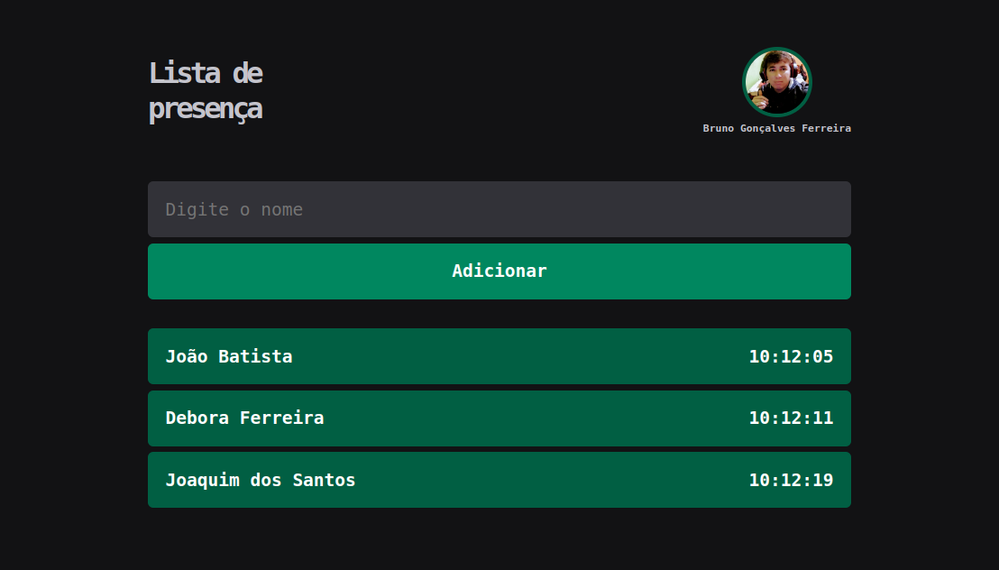

  <h1 align="center">Projeto React - Typescript</h1>

  <p align="center">
    <a href="#-projeto">Projeto</a>&nbsp;&nbsp;&nbsp;|&nbsp;&nbsp;&nbsp;
    <a href="#-tecnologias">Tecnologias</a>&nbsp;&nbsp;&nbsp;|&nbsp;&nbsp;&nbsp;
    <a href="#-como-rodar-projeto">Como rodar projeto</a>&nbsp;&nbsp;&nbsp;|&nbsp;&nbsp;&nbsp;
    <a href="#-licença">Licença</a>
  </p>

  <p align="center">
    
  </p>

  ## 📋 Projeto
  
  <p>
    Este projeto modesto foi desenvolvido utilizando ReactJS e TypeScript, com o propósito de solidificar conceitos fundamentais em React e TypeScript. Além disso, faz uso da biblioteca Styled-Components para a estilização da aplicação e implementa o uso do Use-Context, uma abordagem que facilita o compartilhamento de dados entre todos os componentes de maneira eficaz e clara.
  </p>

  

 ## 👨🏻‍💻 Tecnologias
  <p>
    Abaixo as tecnologias que utilizamos para o desenvolvimento do projeto:

    > Frontend
    1 - React
    2 - Typescript
    3 - Styled-components
  </p>

  ## 💿 Como rodar projeto
  
  <p>Para rodar o projeto localmente, precisamos ter o `Node.js` e o `npm` instalados.</p>

  <Strong>Siga o passo a passo:</Strong>

  > git clone
  ```
  $ git clone https://github.com/brunogoncalvesferreira/user_list.git
  ```

  > Acesse a pasta
  ```
  $ cd user_list
  ```

  > Instale as dependências
  ```
  $ npm install
  ```

  > Iniciar projeto
  ```
  $ npm run dev
  ```
  <a href="https://user-list-eight-lake.vercel.app/">Clique e veja o projeto rodando</a>

  ## 📝 Licença
  
  Este projeto está licenciado com a licença [MIT](https://github.com/brunogoncalvesferreira/treine.me/blob/main/LICENSE)

  <h2>🙋🏻‍♂️ Entre em contato<h2>
  <div style="display: flex;">
    <a href="https://www.linkedin.com/in/bruno-goncalves-ferreira/" target="_blank"></a>
    <a href="mailto:brunogoncalveferreira@outlook.com"></a> 
    <a href="https://www.instagram.com/brunogonferreira/" target="_blank"></a>
  </div>
